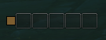
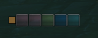
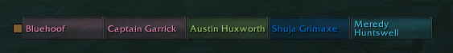
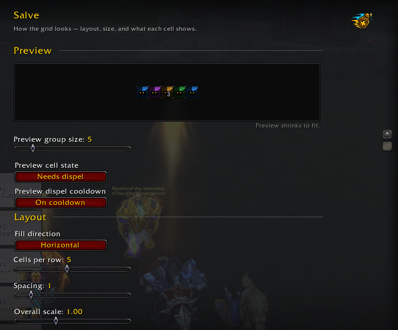

# Salve

**A compact clickable dispel panel for World of Warcraft.** Click a lit group
member to cast the removal spell assigned to that mouse button.

---

## Why Salve exists

WoW: Midnight made aura details private to addons. Older dispel addons were
built around reading those details, so they became unreliable or stopped
working.

Salve is built for the new rules. Blizzard decides which cells light up and
what dispel colour they use; Salve supplies the clickable panel. It can show
and remove debuffs your character can dispel. It cannot inspect them to rank
individual spells, and optional sound alerts can only cover spell IDs in the
current dungeon or raid catalogue.

## What it does

**One box per group member**, in a small grid you can size and place anywhere.

**It lights up instantly.** A box takes the dispel colour of a matching debuff
the moment that member catches something *you* can remove, and dims when they
are clean.

**One click to cleanse.** By default, left click uses your primary dispel.
Where your specialisation has a distinct second dispel covering other schools,
it goes on right click automatically. Every detected action can be rebound.

**Stack counts**, drawn by the game itself, so they follow its own rules.

**All supported dispelling classes** — Paladin, Priest, Druid, Shaman, Monk,
Evoker and Mage. Available spells are detected automatically when you change
specialisation.

## Screenshots

| Clear cells | Dispellable cells | Unit names |
| :--: | :--: | :--: |
|  |  |  |

More settings: [cell appearance](docs/screenshots/options-cell-size-and-alignment.png),
[visibility](docs/screenshots/options-visibility.png), and
[dispels and alerts](docs/screenshots/options-dispels-and-alerts.png).

## How it works

Salve never reads aura details to decide which cells light up.

It hands the game a filter — *harmful auras this character can remove* — along
with the artwork for each box, and the game decides what matches, when the
dispel fill appears, what colour it is and what the stack count says.

This keeps the visible dispel panel small and quiet: Salve does not read or
branch on aura data to decide which cells light up. Separate, location-scoped
learning listeners record only readable aura metadata to improve the bundled
catalogue; private auras remain inaccessible. Dispel colours come from the
game's palette, so colourblind settings are respected automatically.

## Getting started

Install, then type **`/salve`**.

The panel starts in the centre of your screen with a small gold grip above it.
Drag the grip to place it — not the panel itself, whose boxes are buttons and
cover every pixel of it. Use `/salve lock` or right-click the minimap button to
hide the grip once you are happy.

### Commands

| Command | Does |
| :-- | :-- |
| `/salve` or `/salve options` | Open the options panel |
| `/salve unlock` | Show the drag handle |
| `/salve lock` | Hide the drag handle |
| `/salve reset` | Put the panel back in the centre |
| `/salve version` | Print the loaded version and revision |
| `/salve debug` | Print a diagnostic report (`probe` remains an alias) |
| `/salve debug copy` | Open a selectable diagnostic report for copy/paste |
| `/salve snares` | List auto-captured root and snare spell IDs for sharing |
| `/salve learned` / `learned clear` | Inspect or clear learned spell IDs |
| `/salve help` | Print the command list in chat |

Type `/salve` or use **Game Menu → Options → AddOns → Salve → Open Salve
settings**. The Blizzard page is a launcher for Salve's movable settings window,
which remembers where you place it. Its six pages are **Appearance** (layout and
live preview), **Visibility**, **Dispels**, **Troubleshooting**, **Commands** and
**About**.

The Appearance page can show a full-size, non-clickable test panel at the addon's
actual saved screen position. Its group-size, clear or dispellable state and
cooldown controls update that panel immediately, and appearance changes use the
same box styling and layout code as the live panel. The test panel closes with
the settings window and automatically disappears when combat starts; navigating
between settings pages leaves it running.

## Settings worth knowing

**Show unit names** is off by default. The default 20 × 20 boxes are too small
for names to fit — turn names on and raise the box width to around 58 if you
would rather have them.

**Grid flow** separates wrapping from direction. Rows can grow from the left or
right edge; columns can grow from the top or bottom edge. The selected edge
stays anchored as the roster changes, which makes it easier to line Salve up
with unit frames.

The **Dispels** page shows each detected dispel and its mouse binding on one
line. Experimental snare removals are off by default: enable only the actions
you consider valid, then bind them on the same row. Party-wide actions such as
Blessing of Freedom can cast on the clicked member; personal actions such as
Blink light only your own cell. Binding changes made during combat are safely
applied when combat ends.

**Show units with nothing to dispel** holds the panel's shape. Turning it off
makes inactive cells transparent. Their click areas stay in place:
mouse input cannot be changed on a protected frame during combat.

**Alert sound** is optional and off by default. When enabled, Salve loads only
the bundled data module covering the current instance, then registers only its
catalogued spell IDs matching schools your character can remove. Season 1,
Season 2 and future catalogues can coexist without loading or activating one
another. Run `/salve debug` to see the active module, spell ID count and native
sound registrations.

Aura learning is always active. Outdoor discoveries are keyed to the current
map; dungeon and raid discoveries are keyed to their instance. Salve listens
for group aura changes and stores readable dispellable aura names, IDs and
schools in the separate `SalveLearnedDB` block in its saved data; private auras
cannot be learned. It also captures Blizzard-reported roots and snares for
group members through the loss-of-control feed, so no command is needed during
a pull. `/salve learned clear` removes the recorded catalogue.

## Limitations

These are worth stating plainly, because they are not oversights:

- **The visual dispel panel cannot prioritise or hide individual matching
  debuffs.** Both would require inspecting aura details that addons are no
  longer permitted to use for this decision. This is a game restriction, not
  an unfinished priority system.
- **Sound coverage is source-backed but not guaranteed complete.** Encounter
  Journal data covers boss abilities, not every trash debuff. Aura learning
  can collect readable omissions; private auras still require curated data.
- **Dispel colours cannot be customised,** for the same reason. The game owns
  them.

## Licence

Salve is licensed **GPL v3**. See [LICENSE.txt](LICENSE.txt).
